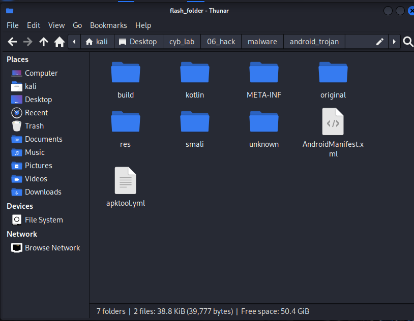
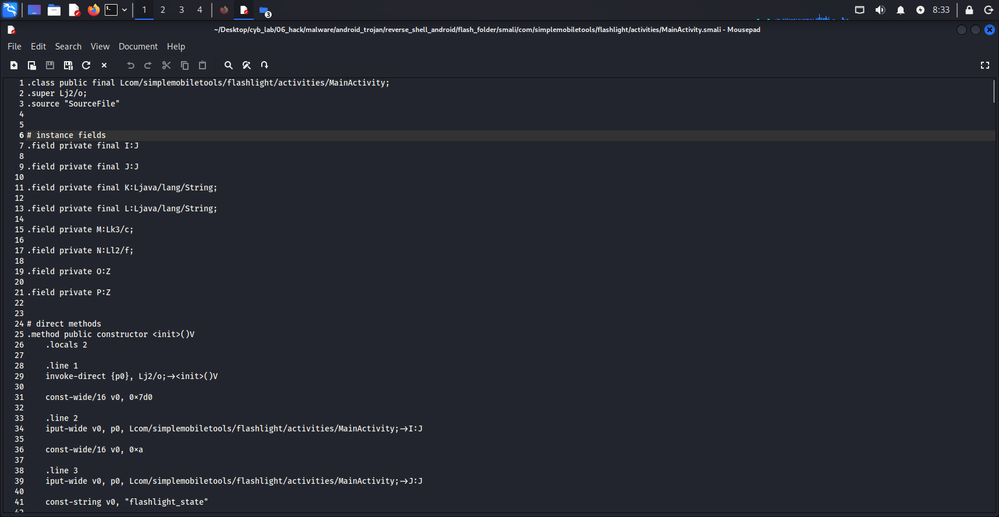
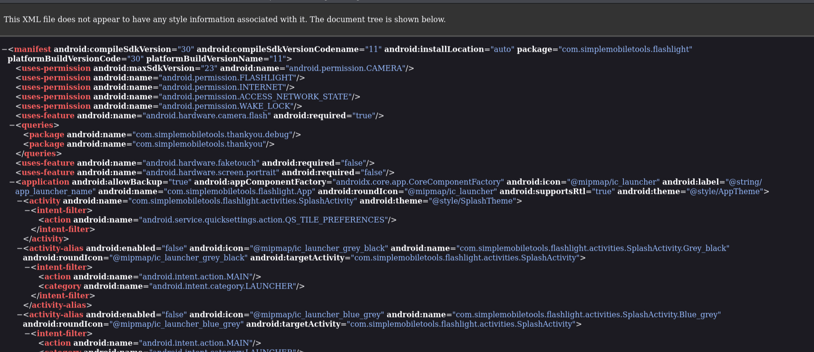
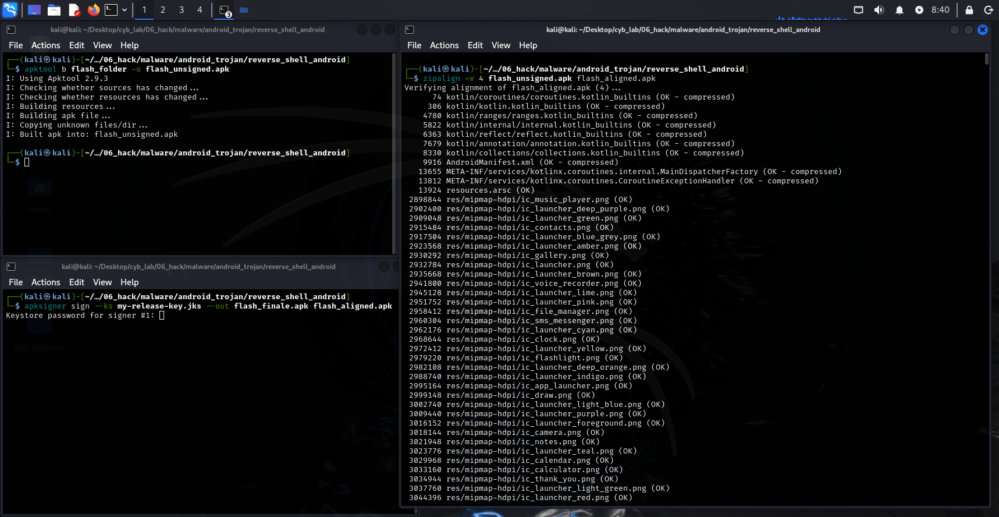

# 📱 Android Application Repackaging & Security Analysis Lab

This project explores the process of **Android APK reverse engineering, modification, and re-signing** within a controlled lab environment.

The objective is to understand how Android applications can be altered after compilation and to analyze the **security risks associated with application tampering**.

---

## 🎯 Objective
This project demonstrates Android application analysis and security implications of APK modification in a controlled lab environment.

---

## 📌 Overview

Android applications (APK files) can be decompiled, modified, and rebuilt.
This lab demonstrates the internal structure of APKs and highlights risks such as:

* Application repackaging
* Unauthorized code modification
* Permission abuse
* Mobile malware distribution techniques

---

## 🧪 Lab Environment

* Android Studio (Android 12 Emulator)
* Decompiled APK analysis
* Smali code inspection
* Manual modification of application components
* APK rebuild, alignment, and signing

---

## 🔍 Key Concepts Explored

* APK structure and lifecycle
* Smali (Dalvik bytecode) fundamentals
* Android permission model
* Application signing and integrity validation
* Risks of third-party APK installation

---

## 🧠 Educational Objectives

This project was developed to understand:

* How Android applications can be reverse engineered
* How attackers may modify legitimate apps
* Why APK signature validation is critical
* How permission changes affect application behavior

---

## 🛡️ Security Perspective

This lab highlights important real-world risks:

* Repackaged applications may contain hidden malicious logic
* Users cannot easily detect modified APKs
* Installing apps from untrusted sources increases exposure

---

## 📸 Lab Screenshots

### APK Analysis (APKTool)

---

### Smali Code Inspection

---

### Manifest Permissions

---

### Rebuild & Signing Process

---

## 🛡️ Security Analysis

A defensive security analysis is included in `/docs/security_analysis.md`, covering risks, attack surfaces, and mitigation strategies observed during the lab.

---

## ⚠️ Ethical & Legal Disclaimer

This project is intended strictly for **educational and defensive security research**.

* Do NOT distribute modified APKs
* Do NOT install altered applications on real user devices
* Perform tests only in isolated lab environments

---

## 📄 License

This project is released under the MIT License.
